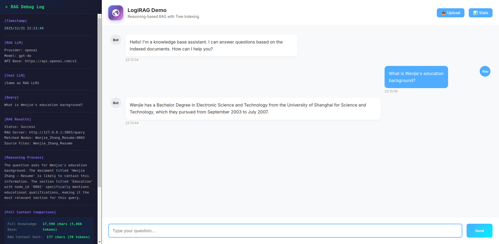
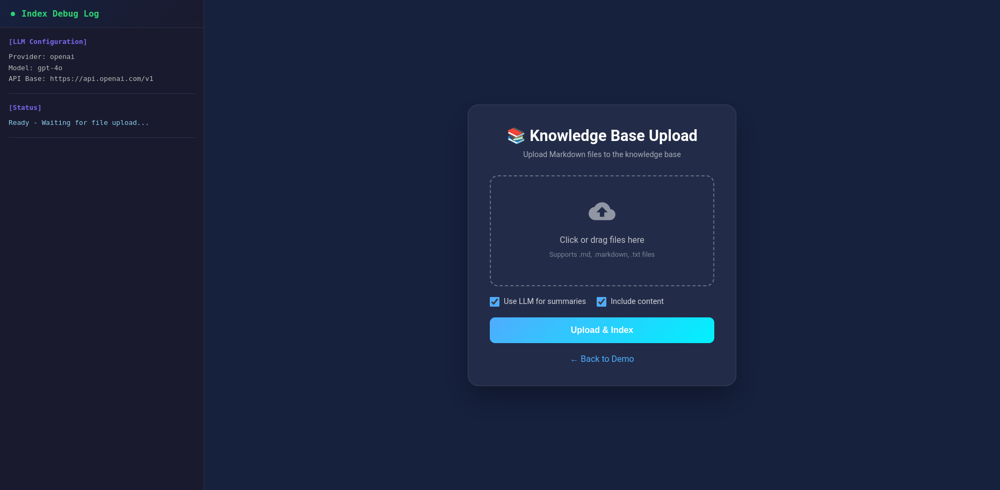

<div align="center">

# LogiRAG

**Reasoning-based RAG with Tree Indexing**

[](https://opensource.org/licenses/MIT)
[](https://www.python.org/downloads/)
[](https://www.docker.com/)

*No Vector DB • No Chunking • Human-like Retrieval • Multi-LLM Support*

[English](README.md) | [中文](README_CN.md)

</div>

---

## 📢 Introduction

**LogiRAG** is an open-source, reasoning-based RAG (Retrieval-Augmented Generation) system inspired by [PageIndex](https://github.com/VectifyAI/PageIndex). It builds a hierarchical tree index from documents and uses LLM reasoning to navigate and retrieve relevant content—just like how humans read documents.

### Why LogiRAG?

Traditional vector-based RAG relies on **semantic similarity**, but **similarity ≠ relevance**. When working with professional documents that require domain expertise and multi-step reasoning, similarity search often falls short.

LogiRAG uses **reasoning-based retrieval**:
1. Build a "Table of Contents" **tree structure** from documents
2. Use LLM to **reason** through the tree to find relevant sections

---

## ✨ Features

### Core Features (Inspired by PageIndex)
| Feature | Description |
|---------|-------------|
| 🚫 **No Vector DB** | Uses document structure and LLM reasoning, not vector similarity |
| 🚫 **No Chunking** | Documents organized into natural sections, not artificial chunks |
| 🧠 **Human-like Retrieval** | Simulates how experts navigate complex documents |
| 📊 **Explainable** | Traceable reasoning process with section references |

### 🚀 LogiRAG Unique Features

| Feature | Description |
|---------|-------------|
| 🌐 **Web Scraping** | Crawl and index web pages with multi-level link following |
| 🖥️ **Web UI** | Built-in chat demo and file upload interface |
| 🤖 **Multi-LLM Support** | Works with OpenAI, Ollama, DeepSeek, Azure, vLLM, LocalAI, and any OpenAI-compatible API |
| 🐳 **Docker Ready** | One-command deployment with Docker Compose |
| 📤 **File Upload** | Drag-and-drop file upload with automatic indexing |
| 💬 **Chat Demo** | Interactive chat interface with RAG debug panel |
| 📊 **Context Savings** | Shows token savings (typically 95%+ reduction) |
| 🔄 **Hot Reload** | Update knowledge base without restart |

---

## 🖼️ Screenshots

### Chat Demo with RAG Debug Panel



- **Left Panel**: RAG Debug Log showing reasoning process, matched nodes, and context statistics
- **Right Panel**: Chat interface with knowledge-based responses
- **99%+ Token Savings**: Only relevant sections are sent to LLM

### File Upload Interface



- Drag-and-drop file upload
- Optional LLM summary generation
- Automatic indexing

---

## 🛠️ Quick Start

### 1. Clone the Repository

```bash
git clone https://github.com/honeywellwenjie/LogiRAG.git
cd LogiRAG
```

### 2. Configure LLM

```bash
cp config.example.yaml config.yaml
# Edit config.yaml with your LLM settings
```

**Example configurations:**

<details>
<summary>OpenAI</summary>

```yaml
llm:
  provider: openai
  api_key: "sk-your-api-key"
  api_base: "https://api.openai.com/v1"
  model: "gpt-4o"
```
</details>

<details>
<summary>Ollama (Local)</summary>

```yaml
llm:
  provider: ollama
  api_base: "http://localhost:11434/v1"
  model: "llama3"
```
</details>

<details>
<summary>DeepSeek</summary>

```yaml
llm:
  provider: openai
  api_key: "sk-your-deepseek-key"
  api_base: "https://api.deepseek.com/v1"
  model: "deepseek-chat"
```
</details>

<details>
<summary>vLLM / LocalAI / LM Studio</summary>

```yaml
llm:
  provider: openai
  api_key: "not-needed"
  api_base: "http://localhost:8000/v1"
  model: "your-local-model"
```
</details>

### 3. Start with Docker (Recommended)

```bash
./tools/restart-rag.sh
```

Or manually:

```bash
cd server
docker compose up -d
```

### 4. Access Web Interface

| Interface | URL | Description |
|-----------|-----|-------------|
| 💬 Chat Demo | http://localhost:3003/demo | Interactive chat with RAG |
| 📤 Upload | http://localhost:3003/upload | Upload knowledge files |
| 📊 Stats | http://localhost:3003/fstats | Knowledge base statistics |
| ❤️ Health | http://localhost:3003/health | Service health check |

---

## 📚 Usage

### Index a Markdown File

```bash
python tools/run_indexer.py --md_path /path/to/document.md
```

### Index a Web Page

```bash
# Single page
python tools/run_web_indexer.py --url https://example.com

# Crawl with depth
python tools/run_web_indexer.py --url https://example.com --level 2 --max-pages 50
```

### API Endpoints

| Endpoint | Method | Description |
|----------|--------|-------------|
| `/query` | POST | RAG query with reasoning |
| `/upload` | POST | Upload and index files |
| `/chat` | POST | Chat with knowledge base |
| `/reload` | POST | Reload all indexes |
| `/fstats` | GET | Knowledge base statistics |
| `/health` | GET | Health check |

**Query Example:**

```bash
curl -X POST http://localhost:3003/query \
  -H "Content-Type: application/json" \
  -d '{"query": "What is LogiRAG?"}'
```

---

## 📁 Project Structure

```
LogiRAG/
├── src/
│   └── knowledge_indexer/     # Core indexing library
│       ├── indexer/           # Document parsing & tree building
│       ├── llm/               # Multi-LLM support
│       ├── retrieval/         # Reasoning-based search
│       └── web/               # Web scraping
├── server/
│   ├── rag_server.py          # Flask API server
│   ├── Dockerfile             # Docker configuration
│   └── docker-compose.yml     # Docker Compose
├── tools/
│   ├── run_indexer.py         # CLI for Markdown indexing
│   ├── run_web_indexer.py     # CLI for web scraping
│   └── restart-rag.sh         # Service restart script
├── result/                    # Generated indexes (gitignored)
├── config.example.yaml        # Configuration template
└── README.md
```

---

## 🔧 Configuration

### Retrieval Modes

LogiRAG supports **three retrieval modes** to balance speed, accuracy, and cost:

| Mode | Description | Best For |
|------|-------------|----------|
| `reasoning` | LLM navigates the tree structure to find relevant content | Small knowledge bases, highest accuracy |
| `vector` | Fast embedding-based similarity search | Large knowledge bases, speed priority |
| `hybrid` | Vector pre-filters candidates, then LLM reasons on filtered set | **Recommended** - balanced approach |

#### Mode Comparison

| Aspect | Reasoning | Vector | Hybrid |
|--------|-----------|--------|--------|
| Speed | ⚡ Slow | ⚡⚡⚡ Fast | ⚡⚡ Medium |
| Accuracy | ⭐⭐⭐⭐⭐ Best | ⭐⭐ Good | ⭐⭐⭐⭐ Very Good |
| Token Cost | High | None | Medium |
| Scalability | Limited | Excellent | Good |

#### Which Mode Should I Use?

| Knowledge Base Size | Recommended Mode | Reason |
|---------------------|------------------|--------|
| **Small** (1-10 docs, <50 nodes) | `reasoning` | LLM can handle all docs; highest accuracy |
| **Medium** (10-50 docs, 50-500 nodes) | `hybrid` | Vector pre-filters; LLM reasons on candidates |
| **Large** (50+ docs, 500+ nodes) | `hybrid` or `vector` | Prevents token explosion; fast retrieval |

> **Tip**: Start with `hybrid` mode - it works well for most cases and automatically balances speed and accuracy.

### Quick Configuration Examples

We provide three example configurations for different modes:

| File | Mode | Use Case |
|------|------|----------|
| `config.example.reasoning.yaml` | Pure LLM | Small docs, max accuracy |
| `config.example.vector.yaml` | Pure Embedding | Large docs, fast search |
| `config.example.hybrid.yaml` | Hybrid | **Recommended** for most cases |

```bash
# Copy the example that fits your needs
cp config.example.hybrid.yaml config.yaml
# Edit with your API keys
```

### Full Configuration Options

```yaml
# RAG LLM Configuration (for search & indexing)
rag_llm:
  provider: openai          # openai, ollama
  api_key: "your-key"       # API key
  api_base: "https://..."   # API endpoint
  model: "gpt-4o"           # Model name
  temperature: 0.1          # Response randomness (low for accuracy)
  max_tokens: 4096          # Max response tokens
  timeout: 60               # Request timeout (seconds)

# Chat LLM Configuration (optional, for responses)
chat_llm:
  provider: openai
  model: "gpt-4o"
  temperature: 0.7          # Higher for natural responses

# Indexer Configuration
indexer:
  add_node_id: true         # Add unique node IDs
  add_node_summary: true    # Generate node summaries
  add_doc_description: true # Generate document descriptions
  max_depth: 6              # Maximum tree depth
  generate_embeddings: true # Required for vector/hybrid modes

# Embedding Configuration (for vector/hybrid modes)
embedding:
  provider: sentence_transformer  # sentence_transformer or openai
  model: "all-MiniLM-L6-v2"       # HuggingFace model name
  device: "cpu"                   # cpu, cuda, or mps

# Retrieval Configuration
retrieval:
  mode: hybrid              # reasoning, vector, or hybrid
  vector:
    enabled: true
    top_k: 20               # Candidates from vector search
    threshold: 0.3          # Minimum similarity score
  reasoning:
    enabled: true
    max_candidates: 10      # Max nodes for LLM reasoning
    max_rounds: 2           # Max search rounds
  hybrid:
    vector_weight: 0.4      # Vector score weight
    reasoning_weight: 0.6   # Reasoning score weight
  max_results: 10           # Final result count
  min_relevance: 0.3        # Minimum relevance threshold

# Web Scraping Configuration
web:
  timeout: 30               # Request timeout
  verify_ssl: true          # Verify SSL certificates
  use_llm_for_conversion: true  # Use LLM for HTML→Markdown
```

### Required Models

#### Embedding Models (Local, Auto-downloaded)

| Model | Dimensions | Speed | Quality |
|-------|------------|-------|---------|
| `all-MiniLM-L6-v2` | 384 | ⚡⚡⚡ Fast | ⭐⭐⭐ Good |
| `all-mpnet-base-v2` | 768 | ⚡⚡ Medium | ⭐⭐⭐⭐ Better |
| `paraphrase-multilingual-MiniLM-L12-v2` | 384 | ⚡⚡⚡ Fast | ⭐⭐⭐ Good (Multilingual) |

#### LLM Options

- **OpenAI**: `gpt-4o`, `gpt-4-turbo`, `gpt-3.5-turbo`
- **Ollama (Local)**: `deepseek-r1:8b`, `llama3`, `mistral`
- **DeepSeek API**: `deepseek-chat`

### Installation for Hybrid Mode

```bash
# Install embedding library
pip install sentence-transformers

# (Optional) For local LLM with Ollama
curl -fsSL https://ollama.com/install.sh | sh
ollama pull deepseek-r1:8b
```

---

## 🆚 Comparison with PageIndex

| Feature | PageIndex | LogiRAG |
|---------|-----------|---------|
| Tree Indexing | ✅ | ✅ |
| Reasoning-based Retrieval | ✅ | ✅ |
| PDF Support | ✅ | ❌ (Markdown/Text) |
| Web Scraping | ❌ | ✅ |
| Multi-level Crawling | ❌ | ✅ |
| Web UI (Chat) | ❌ | ✅ |
| File Upload UI | ❌ | ✅ |
| Docker Deployment | ❌ | ✅ |
| Multi-LLM Support | OpenAI only | ✅ All OpenAI-compatible |
| Local Models | ❌ | ✅ Ollama, vLLM, etc. |
| RAG Debug Panel | ❌ | ✅ |
| Open Source | ✅ MIT | ✅ MIT |

---

## 🏠 Local LLM Support & Limitations

LogiRAG supports local LLMs through Ollama, vLLM, LocalAI, and other OpenAI-compatible servers.

### ✅ What Works

| Feature | Local LLM Status |
|---------|------------------|
| **Index Generation** | ✅ Works well with DeepSeek-R1 (1.5B to 32B) |
| **Node Summaries** | ✅ Generated correctly |
| **Document Descriptions** | ✅ Generated correctly |
| **`<think>` Tag Handling** | ✅ Automatically cleaned for reasoning models |

### ⚠️ Known Limitations

| Feature | Local LLM Status |
|---------|------------------|
| **RAG Retrieval** | ⚠️ Limited accuracy |
| **Query Understanding** | ⚠️ May misinterpret user intent |
| **JSON Response Format** | ⚠️ Sometimes returns empty or malformed |

**Current Status:**
- Local models (tested: DeepSeek-R1 1.5B ~ 32B) can successfully generate tree indexes with summaries
- However, during RAG retrieval, the LLM's reasoning capability is limited, often resulting in:
  - Misunderstanding query intent
  - Returning empty node lists
  - Selecting irrelevant sections

### 🧪 Help Us Test!

We're looking for community feedback on which local models work best for RAG retrieval:

- **Your Model**: Which local model did you test?
- **Index Generation**: Did it work?
- **RAG Retrieval**: Did it correctly match relevant nodes?
- **Configuration**: What settings worked best?

**Please submit your findings as a GitHub Issue!** Your feedback will help us:
1. Identify the minimum model size/capability for effective RAG
2. Optimize prompts for local models
3. Potentially add model-specific optimizations

---

## 🤝 Contributing

Contributions are welcome! Please feel free to submit a Pull Request.

1. Fork the repository
2. Create your feature branch (`git checkout -b feature/AmazingFeature`)
3. Commit your changes (`git commit -m 'Add some AmazingFeature'`)
4. Push to the branch (`git push origin feature/AmazingFeature`)
5. Open a Pull Request

---

## 📄 License

This project is licensed under the MIT License - see the [LICENSE](LICENSE) file for details.

---

## 🙏 Acknowledgments

- Inspired by [PageIndex](https://github.com/VectifyAI/PageIndex) by VectifyAI
- Thanks to all contributors and users

---

## ⭐ Star History

If you find this project useful, please consider giving it a ⭐!

Your star helps others discover this project and motivates continued development.

[](https://github.com/yourusername/LogiRAG)

---

<div align="center">

**[⬆ Back to Top](#-logirag)**

Made with ❤️ by the LogiRAG Community

</div>
